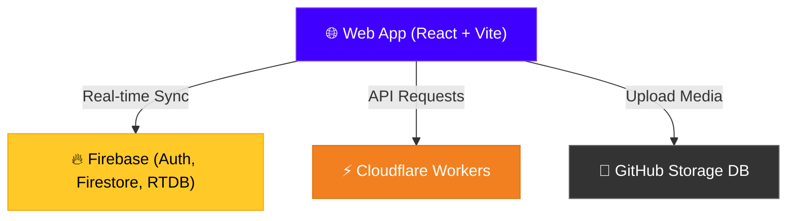

<div align="center">


<br/>

[](https://reactjs.org)
[](https://vitejs.dev)
[](https://firebase.google.com)
[](https://workers.cloudflare.com)

[](https://github.com/udmodz0)
[](https://github.com/udmodz0)
[](https://github.com/udmodz0)
[](https://sannasa.udmodz.site)

<br/>

```
███████╗░█████╗░███╗░░██╗███╗░░██╗░█████╗░░██████╗░█████╗░
██╔════╝██╔══██╗████╗░██║████╗░██║██╔══██╗██╔════╝██╔══██╗
███████╗███████║██╔██╗██║██╔██╗██║███████║╚█████╗░███████║
╚════██║██╔══██║██║╚████║██║╚████║██╔══██║░╚═══██╗██╔══██║
███████║██║░░██║██║░╚███║██║░╚███║██║░░██║██████╔╝██║░░██║
╚══════╝╚═╝░░╚═╝╚═╝░░╚══╝╚═╝░░╚══╝╚═╝░░╚═╝╚═════╝░╚═╝░░╚═╝
```

</div>

---


##  &nbsp;About

> **Sannasa** is a modern, serverless social media and real-time chat platform built for premium aesthetics and fluid interactions. Powered by a hybrid Cloudflare Workers and Firebase architecture, it features a glassmorphism design, real-time message sync, live presence tracking, audio/video call integration, and private storage backed by GitHub.
>
> Official website: **[sannasa.udmodz.site](https://sannasa.udmodz.site)**

<div align="center">

| 🧩 Feature | 📝 Description |
|:---:|:---|
| 💬 **Direct Messaging** | Fluid real-time chats with emoji reactions, media sharing, and stickers |
| 👥 **Groups & Channels** | Community interactions and broadcasting channels with followers |
| 📞 **Live Video Calls** | Integrated RTDB-driven audio and video calls |
| 🛡️ **Premium Admin Panel** | Live user verification, banning controls, and system-wide broadcasts |
| 🐙 **GitHub DB Storage** | Serverless image, voice, and media hosting directly via GitHub API |
| 🌌 **Glassmorphism UI** | Harmonious dark theme with micro-animations and custom wallpapers |

</div>


##  &nbsp;Architecture




## ⚙️ Tech Stack

<div align="center">

<table>
<tr>
<td align="center" width="120">

<br/><b>React</b>
<br/><sub>v18</sub>
</td>
<td align="center" width="120">

<br/><b>Vite</b>
<br/><sub>Bundler</sub>
</td>
<td align="center" width="120">

<br/><b>Firebase</b>
<br/><sub>Database & Auth</sub>
</td>
<td align="center" width="120">

<br/><b>Workers</b>
<br/><sub>Serverless API</sub>
</td>
</tr>
</table>

</div>


## 🚀 Setup & Installation

<details>
<summary><b>💻 1. Local Setup</b></summary>
<br/>

```bash
# Clone the repository
git clone https://github.com/udmodz0/Sannasa.git
cd Sannasa

# Install dependencies
npm install

# Configure Environment variables
cp .env.example .env
# Set up your Firebase Config & Admin login credentials in .env

# Run local development server
npm run dev
```
</details>

<details>
<summary><b>🔥 2. Firebase Environment Setup</b></summary>
<br/>

Add the following environment variables to your `.env` file (which is automatically ignored by Git):
```ini
VITE_FIREBASE_API_KEY=your_api_key
VITE_FIREBASE_AUTH_DOMAIN=your_auth_domain
VITE_FIREBASE_DATABASE_URL=your_database_url
VITE_FIREBASE_PROJECT_ID=your_project_id
VITE_FIREBASE_STORAGE_BUCKET=your_storage_bucket
VITE_FIREBASE_MESSAGING_SENDER_ID=your_messaging_sender_id
VITE_FIREBASE_APP_ID=your_app_id
VITE_FIREBASE_MEASUREMENT_ID=your_measurement_id

VITE_ADMIN_USER=admin_username
VITE_ADMIN_PASS=admin_password
```
</details>

<details>
<summary><b>⚡ 3. Deploy to Cloudflare Workers</b></summary>
<br/>

```bash
# Build the production bundle
npm run build

# Deploy Cloudflare Workers backend
npm run worker:deploy
```
</details>


## 📁 Project Structure

```
Sannasa/
├── 📁 public/             # 🎨 Assets & system logs
├── 📁 src/
│   ├── 📁 components/     # 🧩 ChatWindow, ChatList, Stickers, etc.
│   ├── 📁 context/        # 🔑 AuthState & Profile context
│   ├── 📁 hooks/          # 🧠 Custom presence & auth hooks
│   ├── 📁 pages/          # 📄 Home, Admin panel, Login, Signup
│   └── 📁 services/       # 🔌 Firebase backend configuration
├── 📁 worker/             # ⚡ Cloudflare Worker backend logic
├── 📄 wrangler.toml       # ⚙️ Cloudflare wrangler config
├── 📄 vite.config.js      # ⚡ Vite configuration
├── 📄 .env.example        # 📝 Template for environment keys
└── 📄 README.md           # 📖 You are here!
```


<div align="center">

## 👨‍💻 Creator

<a href="https://github.com/udmodz0">
  
</a>

<br/>

<a href="https://github.com/udmodz0">
  
</a>

<br/><br/>


### ⭐ Star this repo if you found it useful!

<br/>

> 🚫 **This is a FREE Project — Do NOT sell it.**
> 
> Made with 💜 by **UDMODZ**

<br/>


<br/>


</div>
